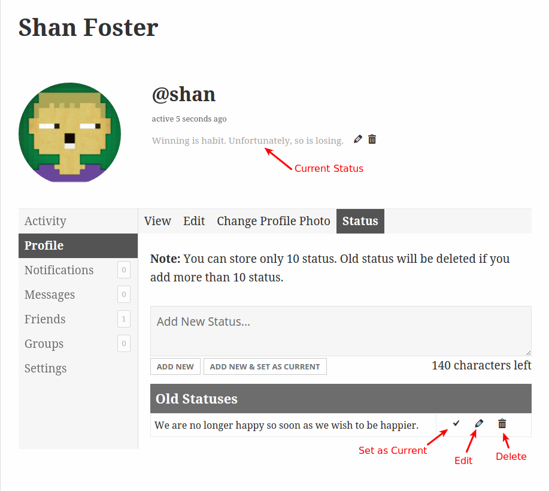
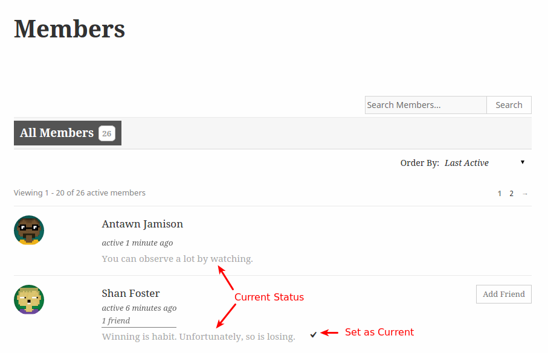

<!-- DO NOT EDIT THIS FILE; it is auto-generated from readme.txt -->
# BP Profile Status

Using BP Profile Status plugin you can set status in your BuddyPress Profile.

**Contributors:** [littlemonks](https://profiles.wordpress.org/littlemonks), [sanket.parmar](https://profiles.wordpress.org/sanket.parmar), [pranalipatel](https://profiles.wordpress.org/pranalipatel)  
**Tags:** [status](https://wordpress.org/plugins/tags/status), [profile](https://wordpress.org/plugins/tags/profile), [members](https://wordpress.org/plugins/tags/members), [buddypress](https://wordpress.org/plugins/tags/buddypress)  
**Requires at least:** WordPress 4.0  
**Tested up to:** WordPress 4.3.1  
**Stable tag:** 1.0  
**License:** [GPLv2 or later](http://www.gnu.org/licenses/gpl-2.0.html)  

## Description ##

BP Profile Status plugin is useful for setting up the status for your BuddyPress Profile.

Also, you can set status from other member's profile.

## Installation ##

### From your WordPress dashboard ###
1. Visit 'Plugins > Add New'
2. Search for 'BP Profile Status'
3. Activate BP Profile Status from your Plugins page.

### From WordPress.org ###
1. Download BP Profile Status.
2. Upload the 'bp-profile-status' directory to your '/wp-content/plugins/' directory, using your favorite method (ftp, sftp, scp, etc...)
3. Activate BP Profile Status from your Plugins page.

## Frequently Asked Questions ##

### Can I use my existing WordPress theme? ###
Yes! BP Profile Status works out-of-the-box with nearly every BuddyPress supported theme.

## Screenshots ##

### My Profile Status

### Member's Loop

## Changelog ##

### 1.0 - Oct 24, 2015 ###
* Inital Release
* Add, Edit, Delete profile status
* Set profile status from other member's profile
* Displaying profile status on member's loop

## Upgrade Notice ##

### 1.0 - Oct 24, 2015 ###
Add, Edit, Delete profile status, set from there member's profile

